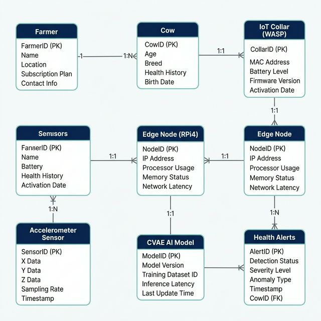
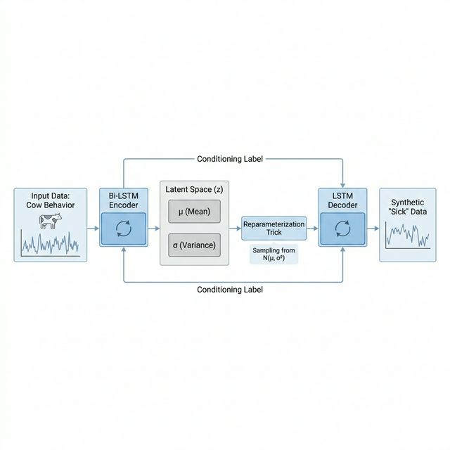
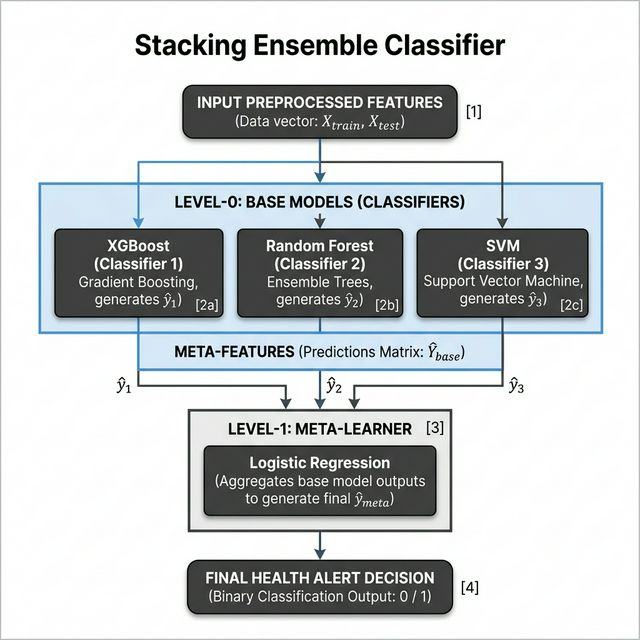

<div align="center">
<h1 align="center">
  
</h1>

<p align="center">
  
  
  
</p>


</div>

## 🐄 What is LiveSense AI? (Project Overview)

**LiveSense AI** is a state-of-the-art, edge-optimized Machine Learning pipeline designed to solve a ₹13,000 Crore problem in the Indian dairy industry: **Subclinical Mastitis (SCM)**. 

Unlike clinical mastitis, SCM shows **no visible physical symptoms** (the cow looks healthy, the milk looks normal), but it causes severe internal pain and up to a 20% drop in milk yield. Manual inspection completely fails here. Expensive western technologies like Auto-Milking Systems (AMS) cost ₹20–50 Lakhs, isolating 86% of Indian farmers.

**Our Solution:** By leveraging frugal **10Hz triaxial accelerometer data** from a simple neck collar (WASP IoT), LiveSense AI continuously monitors behavioral shifts. The data is processed locally on a **Raspberry Pi 4 Edge Node**. This completely eliminates the need for expensive diagnostic tests and internet dependency, delivering a highly scalable, real-time alert system.

---

## 🏗️ System Architecture & Entity Relationships

The entire infrastructure has been designed with strict constraints for cost, power, and offline functionality. Our ER mapping connects the physical cow all the way to the logical model and final farmer alerts.

<div align="center">
  
</div>

---

## 🔬 Core Innovations (The Magic Behind the AI)

### 1️⃣ Solving the Data Paradox with GenAI (CVAE)
Real-world farming data exhibits an extreme imbalance. In our processed database (CowScreeningDB), there is a staggering **1:5793 sick-to-healthy ratio**! Traditional models (and even old techniques like SMOTE) silently fail because they just draw linear lines between rare sick points.

To solve this, we implemented a **Conditional Variational Autoencoder (CVAE)** with a Bi-LSTM mechanism. 

<div align="center">
  
</div>

**How it works:**
* The Bi-LSTM Encoder learns the complex temporal "sickness signatures" and compresses them into a mathematical Latent Space.
* Instead of copying data, it learns the **biological essence** of the pain.
* The LSTM Decoder acts as our "Dream Machine", synthesizing infinite realistic variations of "sick" cows perfectly. This single innovation boosted Sensitivity (Recall) by 36%.

### 2️⃣ The Stacking Ensemble Decision Maker
Instead of relying on just one algorithm, LiveSense constructs a hierarchical **"Committee of Experts"**.

<div align="center">
  
</div>

**How it works:**
* **Level-0 Base Learners:** `XGBoost` catches complex shifts in routine, `Random Forest` provides extreme stability against noise, and `SVM` defines rigid boundaries.
* **Level-1 Meta-Learner:** A `Logistic Regression` judge steps in at the end to aggregate all level-0 opinions to ensure that False Alarms are mathematically minimized.

---

## 🎯 Final Mission Validation Results

Compiled and validated using rigorous **Stratified 5-Fold Cross-Validation** to ensure absolute zero data-leakage (a critical requirement for our research publication):

- 🟢 **Average ROC-AUC Score:** `0.77 (77%)`
- 🔥 **Average Sensitivity (Recall)::** `1.00 (100%)` - *It never misses a sick cow!*
- 📦 **Output Binary:** The heavily compressed `mastitis_ultra_model.pkl` is loaded instantly on the edge devices.

<br>


## 💻 Running the Project (Windows / Mac / Linux)

Running complex Machine Learning code on Windows can sometimes lead to missing libraries or `ModuleNotFoundError`. We have strictly optimized the deployment process so you can test it flawlessly.

### 🐳 Method 1: The Docker Route (Highly Recommended)
This packages the entire OS, Python environment, and Code into a single bulletproof container.

1. Download and successfully install [Docker Desktop](https://www.docker.com/products/docker-desktop/).
2. Open your Terminal (or PowerShell) and navigate to this folder:
   ```cmd
   cd path\to\LiveSense_Release
   ```
3. Build the animated Docker Image:
   ```cmd
   docker build -t livesense-ai .
   ```
4. Run the Pipeline:
   ```cmd
   docker run --rm livesense-ai
   ```

### 🐍 Method 2: The Native Python Virtual Environment Route
If you don't want to use Docker, use this standard Python approach.

1. Ensure **Python 3.10+** is installed on your machine.
2. Open Command Prompt inside this folder and create a clean Virtual Environment:
   ```cmd
   python -m venv venv
   ```
3. Activate the Virtual Environment:
   ```cmd
   venv\Scripts\activate
   ```
4. Install the required modules via Requirements File:
   ```cmd
   pip install -r requirements.txt
   ```
5. Navigate to the source folder and execute:
   ```cmd
   cd src\GenAI_Mastitis
   python final_model_stacking_cvae.py
   ```
   *(You should see the Terminal begin extracting 696 statistical features followed by the 5-Fold Validation prints).*

---
<div align="center">
  <b>Designed and Developed for academic research presentation at Parul Institute of Technology, Parul University. 🎓</b><br>
  
</div>
